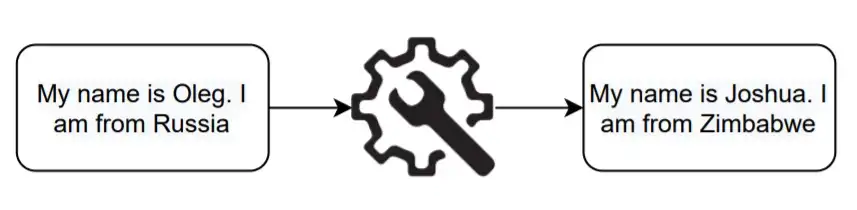

# Text anonymization

This repository contains a simple example of a python pipeline for text anonymization. It is based on two open source 
libraries: [Presidio](https://github.com/microsoft/presidio) and [Faker](https://github.com/joke2k/faker).

You can find a detailed medium post with examples and comments using this link: [Text anonymization with Presidio and Faker](https://medium.com/@olegolego1997/text-anonymization-with-presidio-and-faker-be251f36d5bf)

